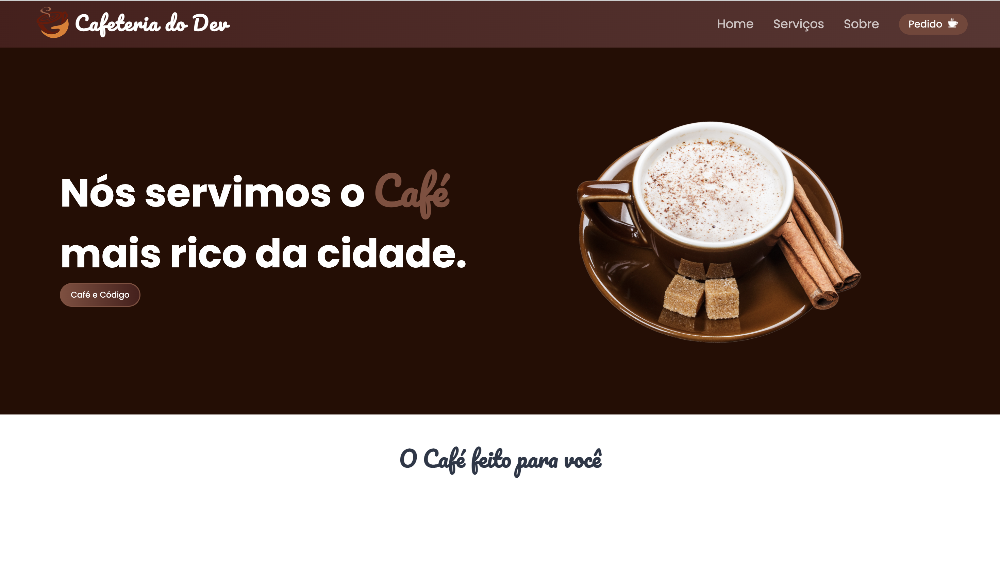
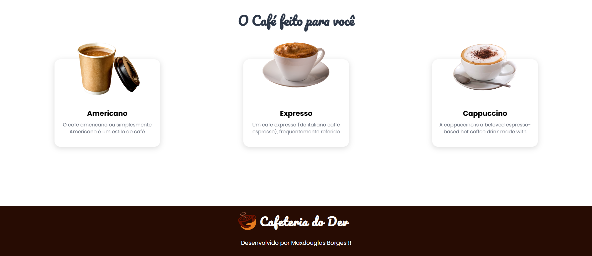

<h1>Cafeteria do Dev</h1>
 

> Home Page
>   

 

> Services Page
>   

 

> <h3>Descrição do projeto</h3>

 

O projeto 'Cafeteria do Dev' é uma aplicação web desenvolvida utilizando HTML, CSS e JavaScript. Meu principal objetivo é entregar um projeto bonito e funcional para o nosso cliente, adaptado a qualquer tipo de tela. Este projeto foi criado para apresentar no meu portfólio no qual apresento meus conhecimentos e aprendizados diarios.

---

  

 <h2>Programadores:</h2>
 Maxdouglas Borges

  

</table>
